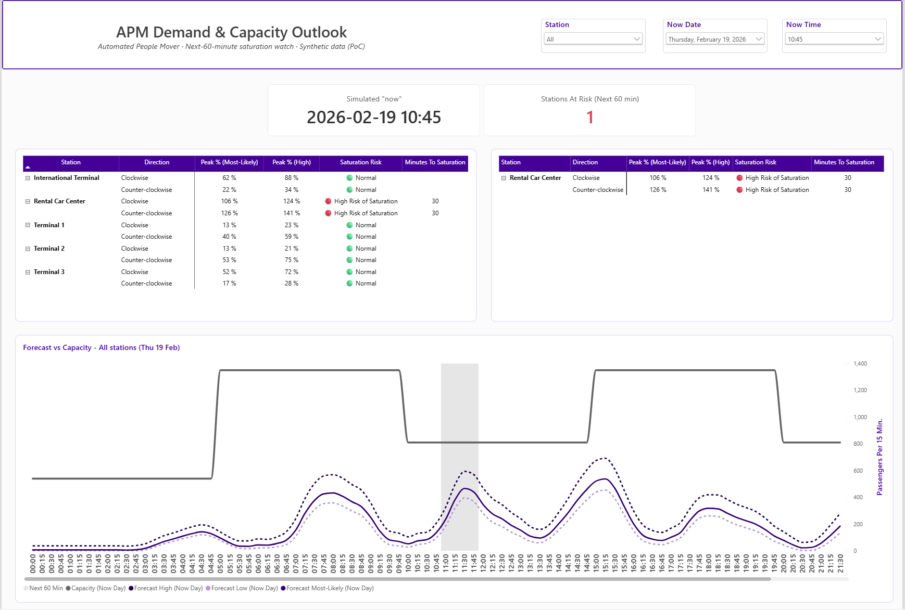
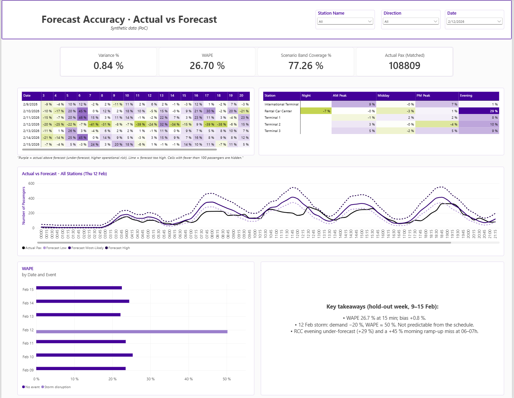
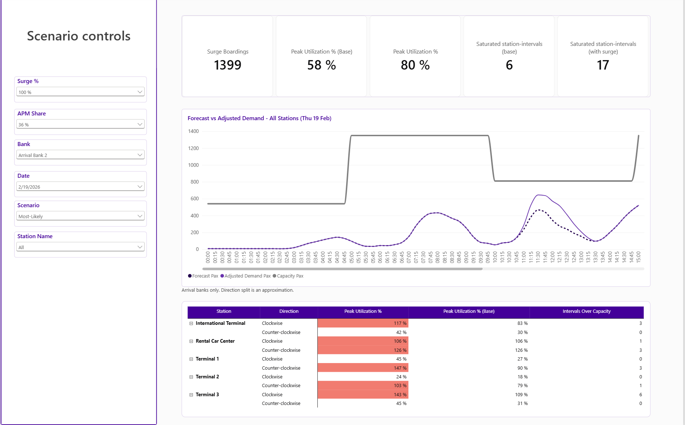

# APM Demand & Capacity Outlook

**A Power BI proof of concept for forecasting demand and planning capacity on an airport Automated People Mover (APM).**
It tells operations *where the train line will saturate in the next hour*, *how far the forecast can be trusted*, and *what happens if a flight bank grows*.

> **All data is synthetic.** No real airport, operator or passenger data was used. The colour palette is inspired by a public airport website for visual reference only; this project is not affiliated with any airport.








---

## 1. Business problem

An APM moves passengers between terminals and the rental-car centre. Demand arrives in **waves driven by flight banks** (groups of arrivals and departures), while capacity changes with the number of trains in service. Operations needs to answer three questions, at 15-minute granularity:

1. **Where will demand exceed capacity in the next 60 minutes?** (act now)
2. **How reliable is the forecast, and where does it fail?** (decide how much to trust it)
3. **What if a flight bank grows or the schedule changes?** (plan ahead)

## 2. What was built

| Page | Question it answers | Main content |
|---|---|---|
| **1. Executive Overview** | What saturates in the next hour? | "Simulated now" selector, stations-at-risk counter, risk table per station and direction, forecast vs capacity chart with the next-60-minute window shaded |
| **2. Forecast Accuracy** | Where and when does the forecast fail? | Variance, WAPE and band coverage; heat maps by station × day-part and date × hour; actual vs forecast for a selected day; event-aware WAPE by day |
| **3. What-If Simulator** | What if a flight bank grows? | Surge %, APM share, bank, scenario and date controls; before/after peak utilisation and saturated intervals per station and direction |

## 3. Key results (hold-out week, 9–15 Feb 2026)

| Metric | Value |
|---|---|
| Model | Schedule-driven ridge regression (champion, chosen on a separate validation week) |
| Bias (actual − forecast) / forecast | **+0.84 %** |
| WAPE at 15 minutes | **26.7 %** (seasonal-profile baseline: 42.5 %) |
| WAPE at one hour | **18.1 %** (baseline: 34.1 %) |
| Share of actuals inside the Low–High band (P10–P90) | **77.3 %** (nominal 80 %) |

What the accuracy page shows:

- **12 Feb storm:** actual demand 20 % below forecast (WAPE ≈ 50 %). The cancellations are not visible in the schedule, so this error is not attributable to the model.
- **Rental Car Center, evening:** the forecast is 29 % too low.
- **06:00–07:00 ramp-up:** actual demand exceeds the forecast by about 45 % on several days. This is a clear model weakness and the first improvement to make.
- Elsewhere in the main day-parts the error is in single digits.

## 4. Solution and data model

```
Fact_APM_Ridership  ─┐
Fact_APM_Forecast   ─┤        Dim_Date (daily)      Dim_Time15 (96)
Fact_Station_Capacity┼──────► Dim_Station           Dim_Direction
Fact_Flight_Schedule ┘        Dim_Flight_Bank       Dim_Scenario      Dim_ModelVersion
```

Star schema, all relationships one-to-many with single-direction filters, from dimension to fact. Grain of the three main facts: **date × 15-minute interval × station × direction**.

| Table | Grain | Purpose |
|---|---|---|
| `Fact_APM_Ridership` | interval × station × direction | Boardings (actuals) |
| `Fact_APM_Forecast` | + model × scenario | P10 / P50 / P90 forecast, long format |
| `Fact_Station_Capacity` | interval × station × direction | Trains planned × boarding capacity per train |
| `Fact_Flight_Schedule` | date × interval × terminal × bank | Scheduled arriving passengers |

### Modelling decisions

| Decision | Rationale |
|---|---|
| Actuals, forecast and capacity in separate facts | Different life cycles; forecasts are re-generated and versioned |
| Scenarios as rows (`Dim_Scenario`), not columns | Native slicer and simpler measures; scenarios are quantiles of the model |
| `Dim_Date` daily, `Dim_Time15` separate | Keeps both dimensions small and lets the date table be marked |
| Disconnected parameter tables (Now, Surge %, APM share) | Scenario logic without altering the model |
| Matching actual and forecast with date flags | Facts are dense, so "matched" periods are the hold-out week; much cheaper than iterating a grid for every card |
| Minimum-volume rule on percent variance | Percent errors on tiny volumes mislead (night: ≈ 0 actual vs a few forecast passengers) |
| No total row on risk tables | A system average (e.g. 58 %) hides a 126 % bottleneck |

## 5. Forecasting approach

- **Calendar:** weeks 1–4 train, week 5 validate and calibrate, week 6 hold-out (has actuals), week 7 future (forecast only).
- **Models:** a seasonal profile baseline and a **schedule-driven ridge regression** using lagged scheduled arrivals and leading scheduled departures of every terminal. Both are implemented in NumPy.
- **Scenarios:** Low / Most-Likely / High are the P10 / P50 / P90 of the model, from residual quantiles calibrated out-of-sample on the validation week. A fixed ±% would assume the same uncertainty at every hour of the day.
- **Champion:** picked on the validation week, not on the hold-out.

## 6. Alert logic

Utilisation = demand ÷ capacity for each 15-minute interval, station and direction. The next-60-minute window is the four intervals after the simulated "now".

| Status | Rule |
|---|---|
| 🔴 High risk of saturation | Most-Likely peak ≥ 100 % |
| 🟡 Risk of saturation | High peak ≥ 100 %, or Most-Likely peak ≥ 85 % |
| 🟢 Normal | Otherwise |

The text and the colour are computed from the same numbers, not from the label.

## 7. What-If simulator

Select one or more **arrival banks**, a surge percentage and the share of arriving passengers that ride the APM. The extra boardings are spread over a lag profile after landing and allocated to each direction by its share of the base forecast.

Example (Thu 19 Feb, Most-Likely, 36 % APM share, **+100 % on Arrival Bank 2**), peak utilisation before → after:

| Station and direction | Before → after |
|---|---|
| Terminal 1, counter-clockwise | 90 % → **147 %** |
| Terminal 3, clockwise | 109 % → **143 %** |
| International Terminal, clockwise | 83 % → **117 %** |
| Terminal 2, counter-clockwise | 79 % → **103 %** |
| Rental Car Center | unchanged (no arriving flights) |

The same surge does not hit every station equally, which is the point of the simulator.

## 8. Data quality: issues found and fixed

Validation compared Power BI against independent calculations on the CSV files. It found two defects in the data generator:

1. **Locale parsing (×10):** counts written with a decimal point were read as thousands separators by a Spanish-locale Power BI. Ratios (WAPE, variance) were unaffected but absolute values were 10× too large. Fixed by setting an explicit `en-US` culture in the Power Query type step.
2. **Station keys shifted by one in `Fact_Flight_Schedule`:** the Rental Car Center appeared to receive arrivals and the International Terminal none. Found through a sense check (the rental-car centre has no arrivals) and fixed in the generator.

The lesson: a validation that compares two copies of the same wrong data passes. Add checks on meaning, not only on consistency.

## 9. Microsoft Fabric / Direct Lake strategy

The PoC runs in Import mode on CSV files. The same model maps to Fabric as follows.

```
Sources: train control / APM telemetry, AODB & flight schedule, capacity plan
   └─► OneLake  Bronze (raw files)
          └─► Notebook / Dataflow Gen2  Silver (cleaned, conformed)
                 └─► Lakehouse  Gold (Delta tables = this star schema)
                        └─► Semantic model in Direct Lake  ──► Power BI reports
   Live path (optional): Eventstream ─► Eventhouse (KQL) for the next-60-minute view
   Forecast: Fabric notebook + MLflow writes Fact_APM_Forecast with a new ModelVersionKey
   Alerts:   Fabric Activator on the next-60-minute risk measure
```

**Keeping Direct Lake from falling back to DirectQuery**
- Direct Lake over the SQL endpoint can fall back to DirectQuery in some conditions (for example views, SQL-level security, or exceeding the capacity guardrails). Direct Lake over OneLake does not fall back. Check the current Microsoft documentation for the mode in use.
- Query Gold **tables, not views**, and keep the table sizes within the capacity guardrails.
- **Direct Lake does not support calculated columns or tables over its tables.** In this model that affects `Day_Part_Order` and the Now selector tables. Move them to Gold (as real columns and tables) and keep only parameter tables that do not reference lake tables (`Surge Pct`, `APM Share`, `Lag Kernel`).
- Use proper Delta types (integer keys, decimal measures): this removes the locale problem above.

**Performance**
- Write Delta with **V-Order**, compact small files regularly (`OPTIMIZE`), and aim for fewer, larger Parquet files.
- Measure with **DAX Studio** (server timings: storage engine vs formula engine, look for DirectQuery events), **VertiPaq Analyzer** (column cardinality and memory) and **Performance Analyzer**.
- Known hot spots: `Surge Boardings` (iterates intervals and calls `CALCULATE` per interval) and `WAPE` (cross-join grid). In production, materialise the lag convolution and the matched hold-out in Gold tables.

**Governance and delivery:** endorsed semantic model, row-level security, lineage view, Git integration (PBIP/TMDL) and deployment pipelines (Dev → Test → Prod).

## 10. Limitations and next steps

| Limitation | Next step |
|---|---|
| Synthetic data, including the capacity assumption (sized so ~2 % of normal intervals saturate) | Calibrate with real telemetry and fleet plans |
| Demand is unconstrained (no queues) | Model queueing and passenger spill |
| Simulator covers **arrival banks only**; departure banks feed the Rental Car Center | Add the departure lead profile |
| Direction split of the surge is an approximation; the lag profile comes from the synthetic generator | Estimate both from observed data |
| Forecast under-estimates the 06:00–07:00 ramp-up and Rental Car Center evenings | Add time-of-day and day-type features; test gradient boosting |
| Band coverage 77 % vs 80 % nominal | Recalibrate quantiles on more weeks |
| "Now" is simulated; there is no live feed | Eventstream / Eventhouse path above |
| No row-level security, CI/CD or monitoring | Standard Fabric delivery practices |

## 11. Repository structure and reproduction

```
Airport apm.pbix            Power BI report (3 pages)
docs/img/                   screenshots used in this README
apm/
  src/generate_apm.py       synthetic data, forecast and capacity
  data/model/*.csv          star schema (+ model_metrics.csv)
  dax/measures_apm.dax      all measures, documented, with validation values
  theme/APM_Operations_theme.json   report theme
  README.md                 data dictionary and assumptions
```

1. `python apm/src/generate_apm.py` (needs `numpy` and `pandas`) regenerates the CSV files in `apm/data/model/`.
2. Open `Airport apm.pbix`, then **Home → Transform data → Manage parameters** and set `DataFolder` to the full path of `apm/data/model/` **including the trailing backslash**. Refresh. If your Windows locale uses a decimal comma, keep the `en-US` culture in the Power Query type steps of the fact tables.
3. Validation values (no filters, champion model, Most-Likely): variance +0.84 %, WAPE 26.70 %, band coverage 77.26 %.

## 12. Disclaimer

Synthetic data, illustrative only. Not affiliated with, or endorsed by, any airport or operator.
